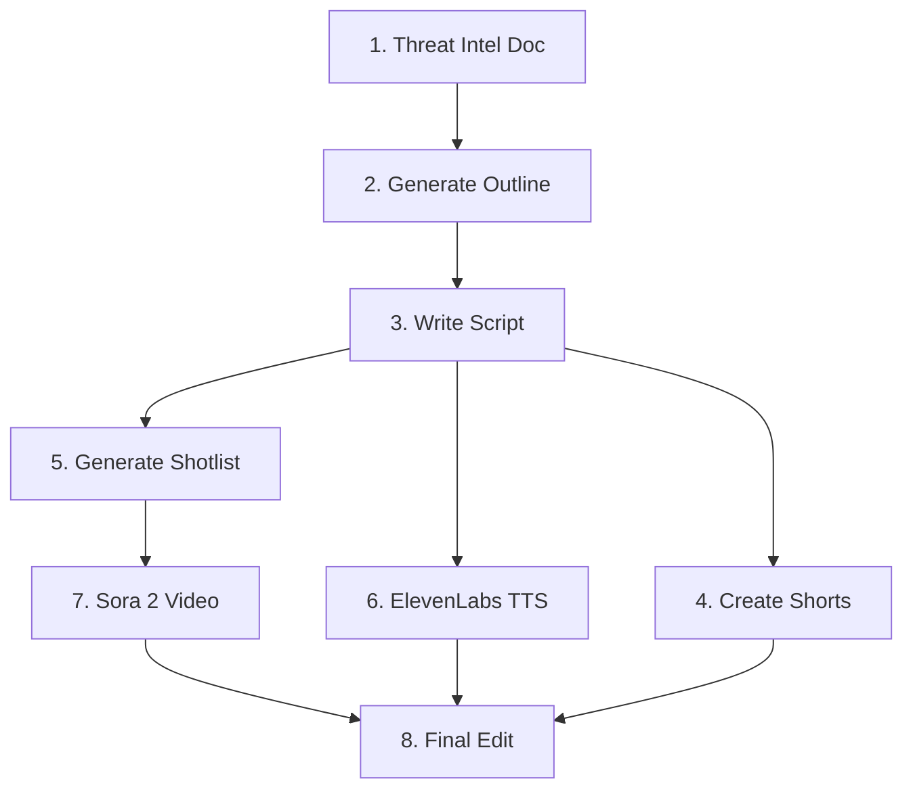

# Shai-Hulud 2025 Campaign

> Cyber threat video pipeline for the Shai-Hulud npm worm (September & November 2025 waves)


---

## Overview

This campaign documents and produces video content covering the **Shai-Hulud npm supply chain worm** — a significant threat to the JavaScript ecosystem in 2025.

### Attack Waves

| Wave | Timeline | Key Characteristics |
|------|----------|---------------------|
| **Wave 1: Genesis** | Sept 8–15, 2025 | ~180–500 malicious packages, `postinstall` hooks, Node.js runtime, single "Shai-Hulud" exfil repo |
| **Wave 2: Second Coming** | Nov 21–24, 2025 | `preinstall` hooks, Bun-based BYOR runtime, self-hosted GitHub Actions runner "SHA1HULUD", 25k–28k+ exfil repos labeled "Sha1-Hulud: The Second Coming", 14k+ unique secrets exfiltrated |

### Video Goal

Produce a 10–14 minute YouTube explainer targeting developers and security engineers, plus 3–5 YouTube Shorts.

---

## Directory Structure

```
campaigns/shai-hulud-2025/
├── README.md                 # This file - campaign overview
├── docs/                     # Technical documentation (source of truth)
│   └── shai-hulud-paradigm.md   # Primary threat intel document
├── data/
│   ├── raw/                  # Intel sources and working notes
│   │   ├── intel-links.md       # Links to vendor reports
│   │   └── notes-snippets.md    # Quick notes from new intel
│   └── processed/            # Generated outputs
│       ├── outline.json         # Video structure (from prompt 01)
│       ├── script-longform.md   # Full video script (from prompt 02)
│       ├── shorts-scripts.md    # YouTube Shorts scripts (from prompt 03)
│       └── shotlist.json        # Sora 2 scene definitions (from prompt 04)
├── prompts/                  # AI prompt templates (the pipeline)
│   ├── 01-threat-to-outline.md  # Gemini 3: Threat doc → JSON outline
│   ├── 02-outline-to-script.md  # Gemini 3: Outline → Long-form script
│   ├── 03-script-to-shorts.md   # Any LLM: Script → Shorts scripts
│   ├── 04-script-to-shotlist.md # Any LLM: Script → Sora 2 shotlist
│   └── 05-elevenlabs-style-note.md  # Voice style guide for TTS
├── scripts/                  # Python/automation scripts
├── audio/                    # ElevenLabs voiceover outputs
│   └── voiceover.mp3
├── video/                    # Sora 2 generated clips
│   └── *.mp4
└── pipeline/                 # Pipeline orchestration code
```

---

## Pipeline Workflow

The content pipeline transforms threat intelligence into finished video assets through 8 sequential steps:



### Step-by-Step Process

| Step | Action | Input | Output | Tool |
|------|--------|-------|--------|------|
| **1** | Place threat intel document | Research & vendor reports | `docs/shai-hulud-paradigm.md` | Manual |
| **2** | Run threat-to-outline prompt | `docs/shai-hulud-paradigm.md` + `prompts/01-threat-to-outline.md` | `data/processed/outline.json` | Gemini 3 |
| **3** | Run outline-to-script prompt | `data/processed/outline.json` + `prompts/02-outline-to-script.md` | `data/processed/script-longform.md` | Gemini 3 |
| **4** | Generate Shorts scripts | `data/processed/script-longform.md` + `prompts/03-script-to-shorts.md` | `data/processed/shorts-scripts.md` | Any LLM |
| **5** | Generate Sora shotlist | `data/processed/script-longform.md` + `prompts/04-script-to-shotlist.md` | `data/processed/shotlist.json` | Any LLM |
| **6** | Generate voiceover | `data/processed/script-longform.md` + `prompts/05-elevenlabs-style-note.md` | `audio/voiceover.mp3` | ElevenLabs |
| **7** | Generate video clips | `data/processed/shotlist.json` | `video/*.mp4` | Sora 2 API |
| **8** | Final video editing | All assets | Final export | DaVinci Resolve / Premiere Pro |

---

## Tech Stack

| Component | Technology | Purpose |
|-----------|------------|---------|
| **LLM (Primary)** | Gemini 3 | Outline generation, script writing |
| **LLM (Secondary)** | Claude / GPT-4 | Shorts scripts, shotlist generation |
| **Video Generation** | Sora 2 | B-roll and visual scenes |
| **Text-to-Speech** | ElevenLabs | Voiceover narration |
| **Video Editing** | DaVinci Resolve / Premiere Pro | Final assembly |
| **Automation** | Python | Pipeline orchestration |

---

## Quick Start

```bash
# Navigate to campaign directory
cd campaigns/shai-hulud-2025

# Generate video outline from threat doc
make outline

# Generate full script from outline
make script

# Generate all text assets (outline → script → shorts → shotlist)
make text-pipeline

# Generate voiceover audio
make audio

# Generate Sora 2 video clips
make sora

# Run full pipeline
make all
```

## Simulation Mode

You can run the entire pipeline in simulation mode without API keys or internet access. This uses fake adapters to generate placeholder content.

```bash
# Run full pipeline in simulation mode
make simulate
```

This will populate `data/processed/` and `audio/` with obviously fake content, allowing you to test the workflow logic.

> **Note:** Makefile commands are placeholders. See `scripts/` for actual implementations.

---

## Adding New Intel

When new threat intelligence becomes available:

### 1. Update Intel Links

Add source URLs to `data/raw/intel-links.md`:

```markdown
## Primary Sources
- [New Vendor: Title of Report](https://example.com/report)
```

### 2. Add Quick Notes

Capture key bullet points in `data/raw/notes-snippets.md`:

```markdown
### Emerging Information
- New finding: [description]
- Updated stat: [metric] changed from X to Y
```

### 3. Update Primary Doc

Incorporate verified intel into `docs/shai-hulud-paradigm.md`, then re-run the pipeline from Step 2.

---

## Future Campaigns

This repository structure supports multiple threat campaigns. Planned/potential future campaigns:

```
campaigns/
├── shai-hulud-2025/      # ← Current campaign
├── log4shell-retro/      # Log4Shell retrospective analysis
├── xz-backdoor-2024/     # XZ Utils supply chain attack
├── polyfill-io-2024/     # Polyfill.io CDN compromise
└── [new-campaign]/       # Template for new campaigns
```

Each campaign follows the same directory structure and pipeline workflow.

---

## Content Guidelines

- **Defensive focus**: Explain mechanics, detection, and remediation — never provide exploit code
- **Visual abstraction**: Use symbolic representations (npm boxes, glowing cubes) not real credentials
- **Vendor neutrality**: Cite multiple sources where statistics differ
- **Pronunciation**: See `prompts/05-elevenlabs-style-note.md` for key terms (Shai-Hulud = "shy-huh-LOOD")

---

## Status

- [ ] Threat intel document complete
- [ ] Video outline generated
- [ ] Long-form script written
- [ ] Shorts scripts created
- [ ] Sora shotlist generated
- [ ] Voiceover recorded
- [ ] Video clips generated
- [ ] Final edit complete
- [ ] Published to YouTube